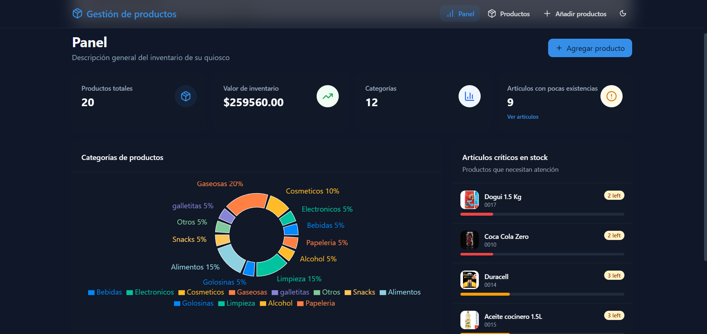
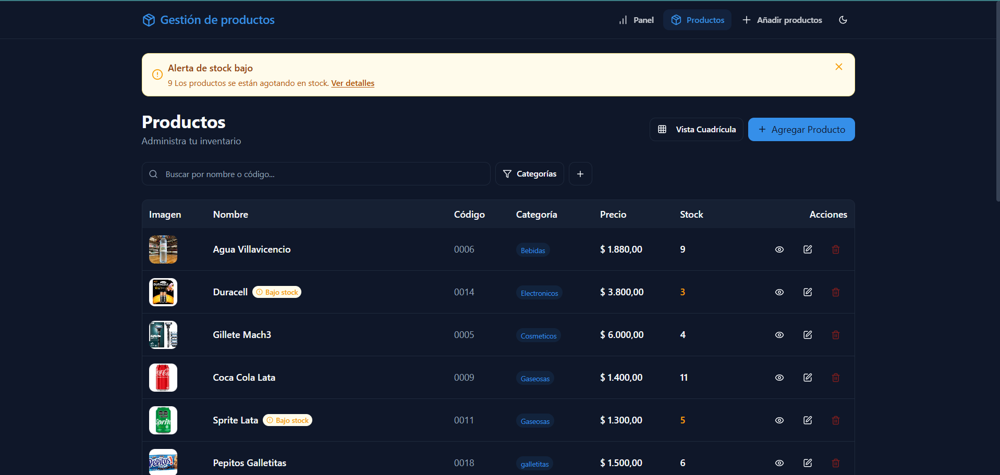

# 📦 Sistema de Gestión de Stock

Aplicación web moderna para la gestión de productos, desarrollada con **React**, **TypeScript**, **TailwindCSS**, **shadcn/ui** y **Firebase**.

🔗 **Demo en producción**: [sistemastock.vercel.app](https://sistemastock.vercel.app/)  
📁 **Repositorio**: [github.com/franciscopassarelli/app-stock](https://github.com/franciscopassarelli/app-stock)

---

## 🚀 Funcionalidades

- 🔐 Almacenamiento de productos en base de datos Firebase.
- 📝 Crear, editar y eliminar productos.
- 📊 Visualización de productos en grande y en tablas.
- 🎨 UI moderna utilizando TailwindCSS y shadcn/ui.
- 📱 Diseño completamente responsive.
- ✅ Alertas lumbral de bajo stock dinámicas.
- 🔔 Notificaciones para stock bajo y según elección.

---

## 🧱 Tecnologías utilizadas

- **Next.js** (framework base)
- **React**
- **TypeScript**
- **TailwindCSS**
- **shadcn/ui**
- **Firebase** (firebase + Firestore)
- **CSS Modules**

---

## 🛠 Instalación y ejecución local

1. Clonar el repositorio:
   ```bash
   git clone https://github.com/franciscopassarelli/app-stock.git
   cd app-stock

2. npm install

3. npm run dev

## 📸 Capturas

### 🧾 Lista de productos
![vista de productos]

### ➕ Lista en filas de producto


### ➕ Lista en filas de producto


Desarrollado 💻 por Francisco Passarelli.